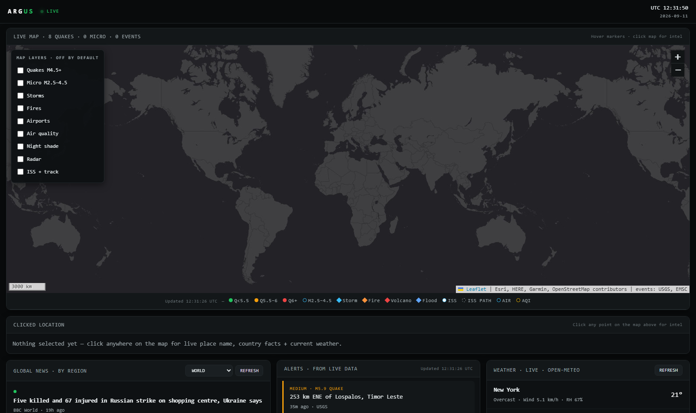

# ARGUS — Open-Source Event Monitor



A lightweight, single-file world event monitor. Open `index.html` in any modern
browser — no build step, no backend, no accounts, no API keys.

Every panel shows **live data from free public sources**. If a source can't be
reached, the panel says so instead of showing fake data. No demo data, ever.

## Quick start

1. Clone or download this folder.
2. Open `index.html` in Chrome, Edge, or Firefox.
3. Tick on map layers in **MAP LAYERS** (all start off) and explore.

Internet is required for live data (map tiles + APIs). Offline, the app still
opens and says so honestly.

## Features

- **Live map** (Leaflet + Esri dark canvas) with 9 opt-in layers:
  quakes, micro-quakes, storms/volcanoes/floods/fires, airports, air quality,
  night shade, precipitation radar, ISS + predicted ground track
- **Fused alerts** derived only from live feeds (never fabricated)
- **Global news** across 9 BBC regions via RSS (World, Africa, Asia, Europe,
  Middle East, Americas, Business, Tech, Science)
- **Wikipedia current-events log**, worldwide public holidays, world clocks
- **Upcoming rocket launches** with countdowns and pad weather
- **City weather, airport weather, FX rates, crypto + indices**
- **Click-anywhere intel**: live place name, country facts, current weather
- UTC clock, live cursor coordinates, scale bar, About guide

## Live sources (all keyless)

| Data | Source |
|---|---|
| Map tiles | Esri + OpenStreetMap |
| Earthquakes M4.5+ | USGS |
| Micro-quakes M2.5–4.5 | EMSC (FDSN) |
| Storms, fires, volcanoes, floods | NASA EONET |
| City/airport weather, air quality | Open-Meteo |
| Precipitation radar | RainViewer |
| Launches | RocketLaunch.Live |
| ISS position | open-notify |
| News | BBC RSS |
| Event log | Wikipedia API |
| Holidays | Nager.Date |
| FX rates | Frankfurter |
| Crypto | CoinGecko · Indices: Stooq |
| Place names / country facts | BigDataCloud · RestCountries |

## Project structure

```text
world-signal/
├── index.html          # the entire app (HTML + CSS + JS)
├── docs/
│   └── screenshot.png  # dashboard screenshot
├── README.md
├── LICENSE
└── .gitignore
```

## Data policy

- Real data only — no simulated events, prices, or alerts.
- Every external source has loading / error / retry states.
- Statuses reflect reality; stale data is labeled STALE.

## License

MIT — see [LICENSE](LICENSE).
